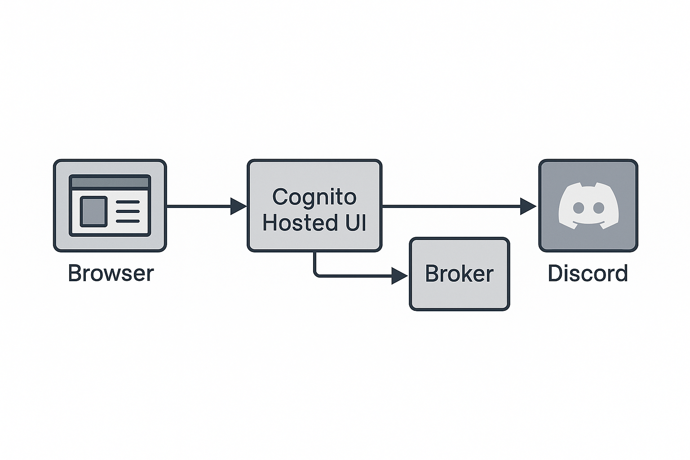

# Discord-Cognito OIDC Broker

## Overview

**Discord-Cognito OIDC Broker** is a lightweight, serverless bridge that lets you use **Discord as a custom OpenID Connect identity provider for AWS Cognito**.  
The broker exposes all mandatory OIDC endpoints (`/.well-known/openid-configuration`, `/authorize`, `/token`, `/userinfo`, `/jwks.json`), handles the full OAuth 2.0 dance with Discord, and signs an RS256 `id_token` that Cognito accepts out of the box.  
Add “Login with Discord” to any Cognito-based application without third-party auth services or password storage.

## Motivation

*phi-brain* is a Discord community analytics platform focused on turning raw server conversations into actionable insights.  
To provide personalized dashboards we needed **friction-free “Login with Discord”**—but relying on a full third-party OAuth 2.0 platform (Auth0, etc.) felt heavy, costly, and meant relinquishing control over user data.

This lightweight broker solves that gap:

* **Own your auth layer** – runs in your AWS account, no vendor lock-in, no monthly fees.  
* **Single flow for every IdP** – Discord, Google, or classic email/password all end in Cognito-signed tokens your API already accepts.  
* **Zero passwords stored** – only federated logins; user credentials never touch our servers.  
* **Serverless by design** – Lambda + API Gateway scale to zero and need virtually no maintenance.

In short, the broker gives *phi-brain* the Discord login it needs **without losing security, control, or simplicity**.

## Why Another Discord ↔ Cognito Integration?

| Challenge with other approaches | How this broker helps |
|---------------------------------|-----------------------|
| **Auth0 / third-party SaaS** → monthly cost, vendor lock-in, rate limits. | 100 % *pay-per-use* (AWS Lambda + API Gateway) and full control of user data. |
| **Self-hosting an OAuth server** → heavy frameworks, long-running containers, manual scaling. | Single Lambda function < 200 KB; scales to zero; no servers to patch. |
| **Custom UI + Cognito “Hosted UI” mismatch** → separate flows for Google, Discord, email/password. | All IdPs (Google, Discord, username/password) return the **same Cognito-signed tokens**—no backend changes. |
| **Storing passwords yourself** → security audits, hashing, breach risk. | Federated login only; no password storage required. |
| **Maintaining user mapping tables** | Broker auto-creates / links users in Cognito and optionally mirrors them in DynamoDB with a single trigger. |
| **Hard-coding secrets in code** | Uses AWS Secrets Manager; supports key rotation without redeploying. |

In short, the broker gives you **zero-cost idle, zero lock-in, and zero passwords** while preserving the native Cognito workflow you already use for Google or email/password.

## Architecture at a Glance

The broker sits **between Cognito Hosted UI and Discord**:

1. **Browser → Cognito Hosted UI**  
   The React UI triggers a standard `/oauth2/authorize` call with `identity_provider=Discord`.

2. **Cognito Hosted UI → Broker /authorize**  
   Cognito forwards the OAuth 2.0 request parameters (`state`, `code_challenge`…).

3. **Broker → Discord**  
   The broker relays the request unchanged, storing no session state.

4. **Discord → Cognito `/oauth2/idpresponse`**  
   Discord returns the `code`; Cognito validates `state`/PKCE and POSTs to **Broker /token**.

5. **Broker /token**  
   Exchanges `code → access_token`, fetches the user profile, creates/links the Cognito user, signs an RS256 `id_token`, and returns it to Cognito.

6. **Cognito → Browser**  
   Cognito finishes its normal flow, issues Cognito-signed ID/Access tokens, and the SPA now has a valid session—identical to Google or email/password flows.

Result: **One uniform token format**, minimal infrastructure (single Lambda + API Gateway), zero passwords stored.

### AWS Deployment Diagram

1. **Amazon API Gateway** – Public HTTPS entry point exposing the five OIDC endpoints.  
2. **AWS Lambda (Broker)** – Implements `/authorize`, `/token`, `/userinfo`, `.well-known`, and signs ID tokens.  
3. **AWS Secrets Manager** – Stores the RSA-256 private key (and Discord client secret) retrieved lazily by the Lambda.  
4. **Amazon DynamoDB** – Optional user metadata store (userId + email ...).

## Set up guide
See the [Quick Setup Guide](./set-up.md) for a step-by-step walkthrough.
